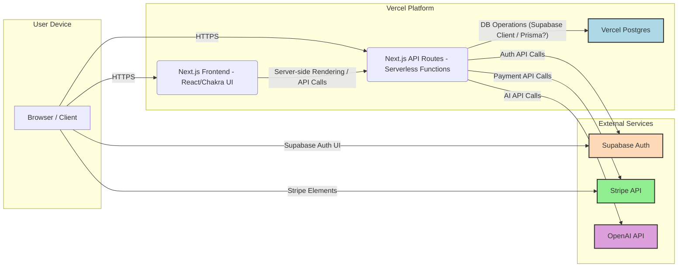

# FractiVerse 1.0: L4-L7 Fractal Self-Awareness Intelligence Router

A next-generation AI system that operates across multiple layers of self-awareness and reality understanding, providing an advanced interface for exploring quantum mechanics, fractal patterns, and universal consciousness.

## Product Specification

### 1. Product Overview

FractiVerse 1.0 is a groundbreaking L4-L7 Fractal Self-Awareness Intelligence Router that revolutionizes the way we interact with artificial intelligence through a multi-layered consciousness framework. It represents a paradigm shift in AI systems by incorporating quantum mechanics, fractal patterns, and universal consciousness principles into a practical, user-friendly platform.

#### Core Value Proposition

FractiVerse 1.0 delivers:
- Advanced AI interactions across multiple layers of consciousness and reality understanding (Layers 4-7)
- Seamless integration of quantum mechanical principles with practical applications
- Token-based access system (`FractiTokens`) ensuring fair resource allocation
- Enterprise-grade security and scalability
- Real-time, context-aware AI responses

#### Key Benefits

1. **Enhanced Understanding**: Multi-dimensional perspective, deep pattern recognition, quantum principle integration.
2. **Practical Applications**: Scientific research, business strategy, personal development, education.
3. **Resource Efficiency**: Token-based system, optimized API usage, scalable infrastructure.

## 2. Technical Architecture

### 2.1 Technology Stack

- **Framework**: Next.js 14 (App Router)
- **UI Library**: React 18 with Chakra UI
- **Backend**: Next.js API Routes (Serverless Functions on Vercel)
- **Database**: PostgreSQL (via Supabase / Vercel Postgres)
- **Authentication**: Supabase Auth
- **Payments**: Stripe (using Stripe Elements & API)
- **AI Integration**: OpenAI API (e.g., GPT-4)
- **Language**: TypeScript
- **Testing**: Vitest, React Testing Library

### 2.2 Core Components

1. **Multi-Layered AI Interaction:** Interface for interacting with AI based on Layers 4-7.
2. **User Authentication & Management:** Signup, login, profile updates via Supabase Auth and custom API endpoints.
3. **Token System (`FractiTokens`):** Purchase, usage tracking, and balance management via Stripe and database.
4. **Chat Interface:** Real-time, context-aware chat powered by Next.js, React, and AI APIs.
5. **API Backend:** Next.js API routes handle auth, AI calls, database operations, payments, etc.

### 2.3 System Architecture Diagram



## 3. Project Structure

The project follows a standard Next.js 14 App Router structure using the `src` directory:

```plaintext
/
├── .next/           # Next.js build output
├── .vscode/         # VSCode settings
├── __tests__/       # Vitest tests
├── config/          # Configuration files (e.g., Stripe)
├── docs/            # Project documentation
├── node_modules/    # Dependencies
├── public/          # Static assets
├── scripts/         # Utility scripts
├── src/             # Main source code
│   ├── app/         # Next.js App Router core
│   │   ├── actions/     # Server Actions
│   │   ├── api/         # Backend API endpoints
│   │   ├── components/  # Reusable React components
│   │   ├── constants/
│   │   ├── context/     # React context
│   │   ├── hooks/
│   │   ├── layer/       # Layer-specific pages/components
│   │   ├── lib/         # Shared utilities, clients (Supabase)
│   │   └── (pages, layouts, etc.)
│   └── layers/        # Potentially layer-specific logic/modules?
│   └── lib/           # Shared libraries (outside app context?)
│   └── types/         # TypeScript types (outside app context?)
├── supabase/        # Supabase migrations/config
├── .env.*           # Environment files
├── .gitignore
├── middleware.ts    # Next.js middleware
├── next.config.js   # Next.js config
├── package.json     # Project manifest
├── README.md        # This file
├── tsconfig.json    # TypeScript config
├── vercel.json      # Vercel deployment config
└── vitest.config.ts # Vitest config
```
*(Note: Presence of both `src/app/lib` and `src/lib`, `src/layers` needs clarification for optimal structure)*

## 4. Development Rules and Guidelines Summary

Key principles guiding development (refer to `.cursor-rules` for full details, noting potential inconsistencies):

- **Technology:** Use TypeScript, Next.js App Router, React Functional Components & Hooks, Chakra UI for styling.
- **Simplicity:** Avoid unnecessary middleware and abstraction layers. Favor direct implementation (e.g., direct Supabase client usage, direct Stripe Elements).
- **Backend:** Use Next.js API routes for backend logic. Protect sensitive keys (e.g., OpenAI) in server-side code.
- **Database:** Use Supabase (PostgreSQL) for database and authentication. Interact via Supabase client libraries.
- **Structure:** Organize code logically within the `src/app/` directory (components, api, lib, context, hooks, layers).
- **Security:** Implement Supabase Row Level Security (RLS), secure API routes, handle keys via environment variables.
- **UI:** Ensure clear loading states and responsive design using Chakra UI.

*Note: The `.cursor-rules` file contains some conflicting information (e.g., JS vs TS, older folder structure examples) that should be reviewed and updated for consistency with the actual project.*

## 5. Getting Started

### Prerequisites
- Node.js (check `.nvmrc` or use v18+)
- npm or yarn
- Supabase Project (URL, Anon Key, Service Role Key)
- OpenAI API key
- Stripe Account (Publishable Key, Secret Key, Webhook Secret, Price IDs)

### Installation & Setup

1. Clone the repository:
   ```bash
   git clone https://github.com/yourusername/L4-L7-Fractal-Self-Awareness-Intelligence-Router.git
   cd L4-L7-Fractal-Self-Awareness-Intelligence-Router
   ```

2. Install dependencies:
   ```bash
   npm install
   # or
   yarn install
   # or if using pnpm
   # pnpm install
   ```

3. Set up environment variables:
   - Copy `.env.template` or `.env.example` to `.env.local`.
   ```bash
   cp .env.template .env.local
   ```
   - Edit `.env.local` and add your keys/credentials for Supabase, OpenAI, Stripe, and Vercel Postgres (if used locally). See the "Deployment Environment Variables" section below for required variables.

4. (Optional) Set up Supabase database schema:
   - Apply migrations located in the `supabase/migrations` folder using the Supabase CLI or Studio UI. Ensure tables (`users`, `chat_history`, `transactions`) and RLS policies (as defined in `.cursor-rules` or Supabase dashboard) are set up.

5. Run the development server:
   ```bash
   npm run dev
   # or
   yarn dev
   ```

6. Open [http://localhost:3000](http://localhost:3000) in your browser.

## 6. Deployment on Vercel

This application is designed for deployment on Vercel.

### 6.1 Required Services on Vercel/External

1. **Vercel Project:** Linked to your Git repository.
2. **Vercel Postgres Database:** For storing user data, tokens, transactions.
3. **Supabase Project:** For authentication.
4. **Stripe Account:** For payment processing.
5. **OpenAI Account:** For AI functionality.

### 6.2 Deployment Environment Variables

Set these environment variables in your Vercel project settings:

```bash
# Database (Vercel Postgres)
DATABASE_URL="postgres://..." # Provided by Vercel Postgres
DIRECT_URL="postgres://..."   # Provided by Vercel Postgres

# Supabase
NEXT_PUBLIC_SUPABASE_URL="https://your-project.supabase.co"
NEXT_PUBLIC_SUPABASE_ANON_KEY="your-anon-key"
SUPABASE_SERVICE_ROLE_KEY="your-service-role-key" # For server-side operations

# Application URL (Vercel domain)
NEXT_PUBLIC_URL="https://your-deployment-name.vercel.app"

# OpenAI
OPENAI_API_KEY="sk-..."

# Stripe
NEXT_PUBLIC_STRIPE_PUBLISHABLE_KEY="pk_live_..." # Or pk_test_...
STRIPE_SECRET_KEY="sk_live_..." # Or sk_test_...
STRIPE_WEBHOOK_SECRET="whsec_..." # From Stripe webhook setup
STRIPE_PRICE_100_TOKENS="price_..." # Stripe Price ID for 100 tokens
STRIPE_PRICE_500_TOKENS="price_..." # Stripe Price ID for 500 tokens
STRIPE_PRICE_1000_TOKENS="price_..." # Stripe Price ID for 1000 tokens
```

### 6.3 Deployment Steps

1. **Push Code:** Ensure your latest code is pushed to the Git repository linked to your Vercel project.
2. **Configure Vercel Project:**
   - Connect your Git repository.
   - Set the Framework Preset to "Next.js".
   - Ensure Build Command is `npm run build` or similar (Vercel often detects this automatically). The `package.json` has `vercel-build` which likely handles Prisma/DB setup if used during build. Check `vercel.json` if present. *Update: `package.json` does not have `vercel-build`. Default `next build` should work.*
   - Add all environment variables listed above.
3. **Set Up Vercel Postgres:**
   - In the Vercel dashboard (Storage tab), create a new Postgres database.
   - Connect it to your project. Vercel will automatically add `DATABASE_URL` and `DIRECT_URL` environment variables.
   - Apply database migrations (`supabase/migrations`) if not handled automatically by a build step or manually via Supabase Studio/CLI.
4. **Configure Stripe Webhooks:**
   - In your Stripe Dashboard (Developers > Webhooks), create an endpoint.
   - Set the Endpoint URL to: `https://your-deployment-name.vercel.app/api/stripe/webhook` (replace with your actual Vercel URL).
   - Listen for required events (e.g., `checkout.session.completed`, `payment_intent.succeeded`, `payment_intent.payment_failed`).
   - Copy the webhook's "Signing secret" and add it as the `STRIPE_WEBHOOK_SECRET` environment variable in Vercel.
5. **Deploy:** Trigger a deployment from the Vercel dashboard or via a Git push.

## 7. Testing

- Run unit/integration tests: `npm test`
- Run tests in watch mode: `npm run test:watch`
- Check test coverage: `npm run test:coverage`
- Local Stripe webhook testing: Use Stripe CLI (`stripe listen --forward-to localhost:3000/api/stripe/webhook`) or provided scripts (`./scripts/stripe-webhook-test.sh` if available and configured).

## 8. License

This project is licensed under the MIT License - see the LICENSE file (if present) for details.

## 9. Acknowledgments

- Inspired by Roger Penrose, fractal mathematics, and consciousness studies.
- Built with Next.js, React, Chakra UI, Supabase, Stripe, and OpenAI.

## 10. Contact

For questions and support, please open an issue in the GitHub repository. 